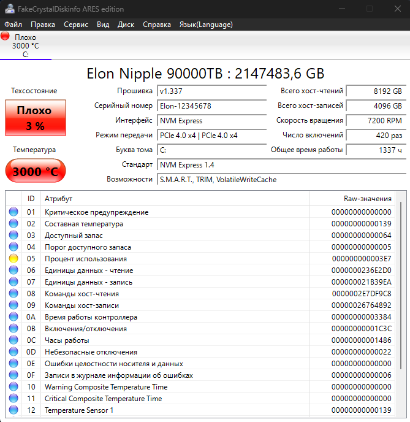

[🇷🇺 Русский](README.md) • [🇬🇧 English](README_EN.md)

<div align="center">

# 💿 CrystalDiskInfo Override Fake info

**Симуляция состояния дисков и подмена S.M.A.R.T. через JSON**

Кастомная сборка CrystalDiskInfo, позволяющая полностью эмулировать (подменять) 
состояние жестких дисков и SSD, их S.M.A.R.T. атрибуты, температуру, ресурс и 
другие параметры через внешний конфигурационный JSON-файл.

<br>

[](https://github.com/A-R-E-S/CrystalDiskInfo-Override-Fake-info/stargazers)
[](https://github.com/A-R-E-S/CrystalDiskInfo-Override-Fake-info/network/members)

[](https://github.com/A-R-E-S/CrystalDiskInfo-Override-Fake-info/releases)
[](https://isocpp.org/)
[](https://visualstudio.microsoft.com/)
[](LICENSE.txt)

</div>

---

## 📸 Скриншоты

<div align="center">

**🇷🇺 Русская версия**



</div>

---

## ⚠️ Дисклеймер

Проект предназначен для **тестирования, разработки и образовательных целей**. 
Подмена S.M.A.R.T. данных может использоваться для обмана систем мониторинга.
Автор не несет ответственности за любое незаконное использование данного ПО.
Используйте инструмент на свой страх и риск.

---

## ✨ Возможности форка

Оригинальный функционал CrystalDiskInfo сохранен полностью. Добавлена возможность 
**динамической подмены данных** через файл `override_config.json`:

- 📝 **Подмена названия приложения:** Изменение заголовка окна (например, на "FakeCrystalDiskinfo ARES edition").
- 💿 **Подмена идентификации диска:** Изменение Модели (`model_name`), Серийного номера (`serial_number`) и Прошивки (`firmware_rev`).
- 📏 **Подмена емкости:** Указание любого размера диска в МБ (`capacity_mb`).
- 🚦 **Подмена статуса здоровья:** Принудительная установка `Good`, `Caution` или `Bad`.
- 📊 **Подмена S.M.A.R.T. атрибутов:** Изменение `Value`, `Worst` и `Raw` для любого ID атрибута.
- 🔋 **Подмена ресурса (Life %):** Установка любого значения износа диска.
- 🌡️ **Подмена телеметрии:** Температура, время работы (часы), число включений, скорость вращения (RPM).
- 🔄 **Подмена статистики хоста:** Всего хост-записей и хост-чтений.
- 🤖 **Механизм "auto":** Если параметр в JSON равен `"auto"` или отсутствует, программа берет реальные данные с железа.

---

## ⚙️ Конфигурация (`override_config.json`)

Создай файл `override_config.json` рядом с исполняемым файлом (`.exe`). 
Пример конфигурации со всеми доступными полями:

```json
{
  "app_name": "FakeCrystalDiskinfo ARES edition",
  "disks": [
    {
      "match": {
        "model": "auto",
        "serial": "auto"
      },
      "model_name": "Elon Nipple 90000TB",
      "serial_number": "Elon-12345678",
      "firmware_rev": "v1.337",
      "capacity_mb": 9000000000,
      "status": "Bad",
      "life": 3,
      "temperature": 3000,
      "power_on_hours": 1337,
      "power_on_count": 420,
      "rotation_rate": 7200,
      "host_writes": 4096,
      "host_reads": 8192,
      "attributes": [
        {
          "id": 5,
          "value": 1,
          "worst": 1,
          "raw": 999
        }
      ]
    }
  ]
}
```

### Пояснение полей:
1. `match` — Критерии поиска диска (можно указать модель/серийник или оставить `"auto"` для применения к первому найденному диску).
2. Числовые параметры (емкость, температура и т.д.) пишутся как числа. Строковые (модель, статус) — в кавычках.
3. Если файла `override_config.json` нет рядом с `.exe`, программа работает как оригинальная.

---

## 🚀 Сборка из исходников

### Требования
- Windows 10/11
- Visual Studio 2019 или 2022
- Установленные компоненты: 
  - Разработка классических приложений на C++ (Desktop development with C++)
  - Поддержка MFC и ATL (x86 и x64)

### Шаги сборки

1. **Клонируйте репозиторий:**
   ```bash
   git clone https://github.com/A-R-E-S/CrystalDiskInfo-Override-Fake-info.git
   cd CrystalDiskInfo-Override-Fake-info
   ```

2. **Добавьте библиотеку JSON (nlohmann/json):**
   - Скачайте актуальную версию `json.hpp` с [официального репозитория](https://github.com/nlohmann/json/releases).
   - В папке с исходниками создайте папку `Library` (если её нет).
   - Внутрь `Library` поместите `json.hpp`.
   - Итоговый путь должен быть: `CrystalDiskInfo-Override-Fake-info\Library\json.hpp`.

3. **Откройте и соберите проект:**
   - Откройте `DiskInfo.sln` в Visual Studio.
   - Выберите конфигурацию (например, `Release | x64`).
   - Нажмите `Ctrl + Shift + B` (Собрать решение).

> **Note
> Copy `CdiResource` folder in the Download CdiResource to `../Rugenia` folder created in the build. If the `CdiResource` folder does not exist at runtime, the app displays "Not Found 'Graph.html'."**

Скомпилированный `.exe` появится в папке `../Rugenia` (относительно папки исходников). Туда же нужно класть `override_config.json`.

---

## 📄 Лицензия

Проект базируется на CrystalDiskInfo и распространяется под лицензией [MIT](LICENSE.txt).

<div align="center">

### Если проект оказался полезным — поставь ⭐
Это реально помогает развитию проекта!

</div>
