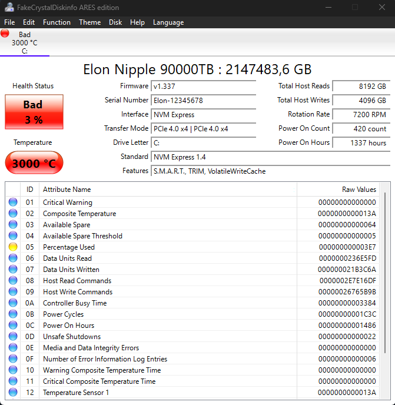

[🇷🇺 Русский](README.md) • [🇬🇧 English](README_EN.md)

<div align="center">

# 💿 CrystalDiskInfo Override Fake info

**Disk state simulation and S.M.A.R.T. spoofing via JSON**

A custom build of CrystalDiskInfo that allows you to fully emulate (spoof) 
the state of hard drives and SSDs, their S.M.A.R.T. attributes, temperature, 
lifespan, and other parameters via an external JSON configuration file.

<br>

[](https://github.com/A-R-E-S/CrystalDiskInfo-Override-Fake-info/stargazers)
[](https://github.com/A-R-E-S/CrystalDiskInfo-Override-Fake-info/network/members)

[](https://github.com/A-R-E-S/CrystalDiskInfo-Override-Fake-info/releases)
[](https://isocpp.org/)
[](https://visualstudio.microsoft.com/)
[](LICENSE.txt)

</div>

---

## 📸 Screenshots

<div align="center">

**🇬🇧 English version**



</div>

---

## ⚠️ Disclaimer

This project is intended for **testing, development, and educational purposes**. 
Spoofing S.M.A.R.T. data can be used to deceive monitoring systems.
The author is not responsible for any illegal use of this software.
Use the tool at your own risk.

---

## ✨ Fork Features

The original functionality of CrystalDiskInfo is fully preserved. The ability to 
**dynamically spoof data** via the `override_config.json` file has been added:

- 📝 **App Name Override:** Change the window title (e.g., to "FakeCrystalDiskinfo ARES edition").
- 💿 **Disk Identification Override:** Change Model (`model_name`), Serial Number (`serial_number`), and Firmware (`firmware_rev`).
- 📏 **Capacity Override:** Specify any disk size in MB (`capacity_mb`).
- 🚦 **Health Status Override:** Force set to `Good`, `Caution`, or `Bad`.
- 📊 **S.M.A.R.T. Attributes Override:** Change `Value`, `Worst`, and `Raw` for any attribute ID.
- 🔋 **Lifespan Override (Life %):** Set any disk wear level value.
- 🌡️ **Telemetry Override:** Temperature, power-on hours (hours), power-on count, rotation rate (RPM).
- 🔄 **Host Statistics Override:** Total host writes and host reads.
- 🤖 **"auto" mechanism:** If a parameter in the JSON is set to `"auto"` or is missing, the program fetches real data from the hardware.

---

## ⚙️ Configuration (`override_config.json`)

Create an `override_config.json` file next to the executable (`.exe`). 
Example configuration with all available fields:

```json
{
  "app_name": "FakeCrystalDiskinfo ARES edition",
  "disks": [
    {
      "match": {
        "model": "auto",
        "serial": "auto"
      },
      "model_name": "Elon Nipple 90000TB",
      "serial_number": "Elon-12345678",
      "firmware_rev": "v1.337",
      "capacity_mb": 9000000000,
      "status": "Bad",
      "life": 3,
      "temperature": 3000,
      "power_on_hours": 1337,
      "power_on_count": 420,
      "rotation_rate": 7200,
      "host_writes": 4096,
      "host_reads": 8192,
      "attributes": [
        {
          "id": 5,
          "value": 1,
          "worst": 1,
          "raw": 999
        }
      ]
    }
  ]
}
```

### Field Explanations:
1. `match` — Disk search criteria (you can specify model/serial or leave it as `"auto"` to apply to the first found disk).
2. Numeric parameters (capacity, temperature, etc.) are written as numbers. Strings (model, status) are in quotes.
3. If the `override_config.json` file is not found next to the `.exe`, the program operates as the original version.

---

## 🚀 Building from Source

### Requirements
- Windows 10/11
- Visual Studio 2019 or 2022
- Installed components: 
  - Desktop development with C++
  - MFC and ATL support (x86 and x64)

### Build Steps

1. **Clone the repository:**
   ```bash
   git clone https://github.com/A-R-E-S/CrystalDiskInfo-Override-Fake-info.git
   cd CrystalDiskInfo-Override-Fake-info
   ```

2. **Add the JSON library (nlohmann/json):**
   - Download the latest version of `json.hpp` from the [official repository](https://github.com/nlohmann/json/releases).
   - Create a `Library` folder in the source directory (if it doesn't exist).
   - Place `json.hpp` inside the `Library` folder.
   - The final path should be: `CrystalDiskInfo-Override-Fake-info\Library\json.hpp`.

3. **Open and build the project:**
   - Open `DiskInfo.sln` in Visual Studio.
   - Select the configuration (e.g., `Release | x64`).
   - Press `Ctrl + Shift + B` (Build Solution).

> **Note
> Copy `CdiResource` folder in the Download CdiResource to `../Rugenia` folder created in the build. If the `CdiResource` folder does not exist at runtime, the app displays "Not Found 'Graph.html'."**

The compiled `.exe` will appear in the `../Rugenia` folder (relative to the source folder). You should also place `override_config.json` there.

---

## 📄 License

The project is based on CrystalDiskInfo and is distributed under the [MIT](LICENSE.txt) license.

<div align="center">

### If you found this project useful — please give it a ⭐
It really helps the project grow!

</div>